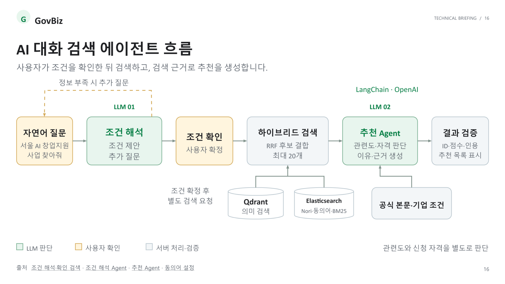
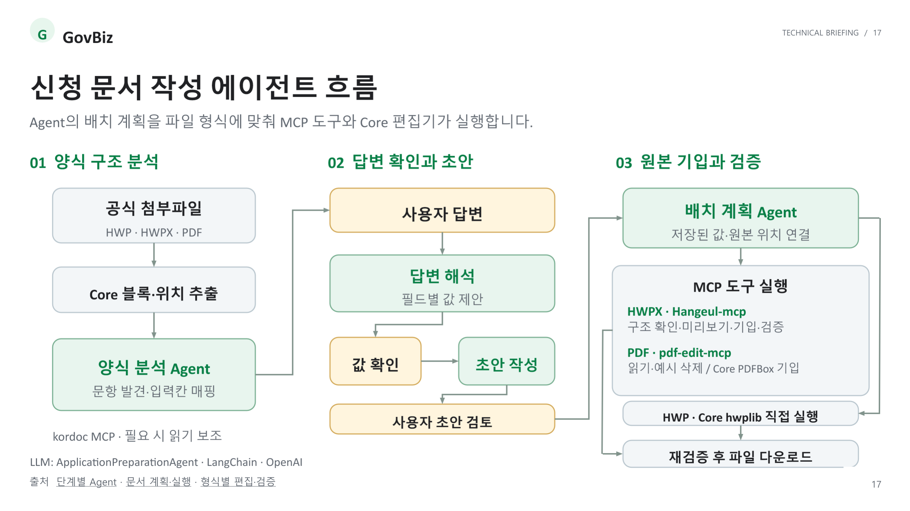
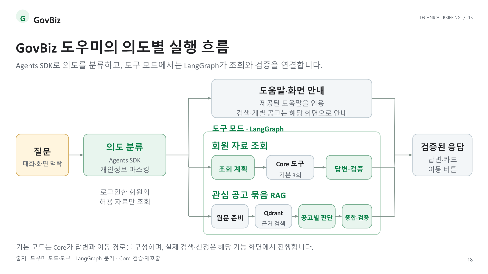

# 🏛️ GovBiz

**LLM 기반 정부지원사업 탐색·신청 관리 플랫폼**

<!-- 팀 소개와 프로젝트 구성은 https://github.com/lsm15111/GovBiz-docs 의 README를 바탕으로 작성했습니다. -->

## 1. 팀 소개

### 👥 팀원 소개

<table>
  <tr>
    <td align="center">
      <br>
      <b>김건우(팀장)</b><br>
      <a href="https://github.com/ilil1">
        
      </a>
    </td>
    <td align="center">
      <br>
      <b>김동섭</b><br>
      <a href="https://github.com/20220348-kim">
        
      </a>
    </td>
    <td align="center">
      <br>
      <b>이성민</b><br>
      <a href="https://github.com/lsm15111">
        
      </a>
    </td>
    <td align="center">
      <br>
      <b>송승재</b><br>
      <a href="https://github.com/Genus-Jae">
        
      </a>
    </td>
    <td align="center">
      <br>
      <b>홍지윤</b><br>
      <a href="https://github.com/JiYoon241111">
        
      </a>
    </td>
  </tr>
</table>

## 2. 프로젝트 개요

### 📢 프로젝트 소개

GovBiz는 여러 정부기관과 공공 플랫폼에 분산된 지원사업 공고를 통합하고, 기업이 자신에게 적합한 사업을 탐색한 뒤 신청 준비와 진행 관리까지 이어갈 수 있도록 지원하는 AI 기반 정부지원사업 플랫폼입니다.

기업마당·K-Startup·과학기술정보통신부·충청남도 온라인수출지원시스템 등 공식 제공처의 공고를 수집·정규화하여 통합 검색 환경을 제공합니다. 사용자는 조건별 필터 검색과 AI 대화 검색을 통해 공고를 탐색하고, 공식 원문에 기반한 추천 이유와 신청 조건을 확인할 수 있습니다.

검색한 공고는 관심 공고함에 저장해 달력·목록으로 일정을 확인하고, 준비 중·지원 완료·서류 심사·발표 심사·선정·탈락 단계로 진행 상황을 관리할 수 있습니다. 또한 신청 문서 작성, 중복 지원·수혜 가능성 검토, 협업 파트너 모집과 제안 등의 기능을 통해 지원사업의 전 과정을 하나의 서비스에서 관리할 수 있도록 구성했습니다.

### 🎯 프로젝트 필요성과 목표

| 해결할 문제 | 프로젝트 목표 |
|---|---|
| 여러 기관에 분산된 지원사업 정보를 찾는 데 많은 시간 소요 | 공식 제공처의 공고를 수집·정규화하여 하나의 서비스에서 통합 검색 |
| 공고마다 문서 형식과 표현이 달라 정보 비교와 신청 준비가 어려움 | 공고 정보를 공통 구조로 정리하고, 공식 첨부 양식 분석과 사용자 확인 정보를 바탕으로 지원 형식의 신청 문서 생성 |
| 키워드 검색만으로 기업 상황과 지원 목적을 반영하기 어려움 | 키워드·의미 기반 검색을 결합하고, AI 대화의 추가 질문으로 조건을 구체화해 맞춤 공고 추천 |
| AI 추천 결과의 정확성과 신뢰성을 검증하기 어려움 | 공식 원문을 근거로 추천 이유와 신청 조건을 제시하고, 검색 관련도와 실제 신청 자격을 구분해 안내 |
| 공고 탐색 이후 일정과 신청 진행 상황을 별도로 관리해야 함 | 관심 공고를 달력·목록으로 확인하고, 준비·지원 완료·심사·선정·탈락까지 진행 단계 관리 |
| 기존 지원·수혜 이력에 따른 중복 지원 제한을 확인하기 어려움 | 지원·수혜 이력과 공식 공고 자료를 비교해 중복 제한과 추가 확인 사항 검토 |
| 공동 참여에 필요한 협업 기업을 찾고 제안할 수단이 부족함 | 지원사업별 파트너 모집과 참여 제안 기능으로 기업 간 협업 연결 |

## 3. 기술 스택

### Frontend


### Backend · Core API


### AI Service


### Database · Search


### Cache · Messaging


### Infrastructure · Deployment


### CI/CD


## 4. 주요 기능

| 기능 | 설명 |
|:---:|:---|
| 지원사업 통합 검색 | 여러 공식 제공처의 공고를 AI 대화 검색과 조건별 필터 검색으로 탐색 |
| 근거 기반 공고 분석 | 관련도·추천 이유·신청 조건을 제공하고 기업마당 공식 원문에 기반한 질의응답 지원 |
| 기업 맞춤 리포트 | 저장된 기업 정보를 기반으로 지원사업을 추천하고 웹·이메일 리포트 제공 |
| 관심 공고 관리 | 관심 공고를 달력과 목록으로 확인하고 신청 진행 단계를 체계적으로 관리 |
| 신청 문서 작성 | 공식 첨부 양식을 분석하고 사용자 확인 답변을 반영한 초안 작성·지원 형식의 문서 생성 및 다운로드 |
| 중복 지원·수혜 검토 | 복수 사업의 공식 자료와 지원 이력을 비교하여 제한 및 확인 필요 사항 안내 |
| 파트너 관리 | 공고별 협업 기업 모집과 참여 제안·수락·거절·철회 기능 제공 |

신청 문서 생성은 HWP·HWPX·PDF의 지원 구조에 한해 제공하며, HWP 편집에는 별도 Windows 브리지가 필요합니다. 세부 범위는 [문서 생성 안내](docs/application-document-mcp-architecture.md)에서 확인할 수 있습니다.

### 4-1. 검색부터 신청 이후까지 연결하는 통합 관리

GovBiz는 공고 탐색부터 신청 준비와 진행 관리까지 하나의 흐름으로 연결합니다. 사용자는 관심 공고를 저장하고 접수 일정을 확인하며, 신청 문서를 준비하고 심사 결과까지 단계별로 관리할 수 있습니다.

> 지원사업 탐색 → 근거·자격 확인 → 관심 공고 저장 → 신청 문서 작성 → 진행 단계 관리 → 중복 검토·파트너 협업

### 4-2. 공식 원문을 기반으로 한 근거 확인

추천 이유와 신청 조건을 공식 공고 원문에서 확인할 수 있도록 근거를 함께 제시합니다. 검색 관련도와 실제 신청 자격을 구분하여 사용자가 AI의 판단을 직접 검토할 수 있도록 설계했습니다.

### 4-3. 기업 맞춤형 탐색과 지속 관리

기업의 지역·업종·설립 기간·지원 목적을 반영한 AI 대화 검색과 조건별 필터 검색을 함께 제공합니다. 저장된 기업 정보를 기반으로 맞춤 지원사업 리포트를 생성하고 이메일로도 제공하여, 사용자가 매번 새로운 공고를 직접 검색해야 하는 부담을 줄입니다.

### 4-4. 중복 지원 검토와 기업 간 협업

여러 사업에 동시에 지원하거나 기존 수혜 사업이 있는 경우 공식 자료와 지원 이력을 비교하여 중복 지원·수혜 제한 가능성을 안내합니다. 또한 특정 공고를 기준으로 협업 기업을 모집하고 참여를 제안할 수 있어, 단독 신청뿐 아니라 기업 간 공동 참여까지 지원합니다.

## 5. 시스템 아키텍처

<p align="center">
  
</p>

### 📌 서비스 구성 및 운영 흐름

GovBiz는 Vercel과 AWS 환경에 배포할 수 있도록 프론트엔드, Core API, AI Service, 데이터 저장소를 분리하여 구성했습니다.

1. 사용자는 웹 브라우저를 통해 Vercel에 배포되는 React 프론트엔드에 접속합니다.
2. 프론트엔드의 `/api` 요청은 CloudFront를 거쳐 VPC 내부의 Nginx로 전달됩니다.
3. Nginx는 요청을 Spring Boot 기반 Core API로 프록시합니다.
4. Core API는 계정, 공고 검색, 관심 공고, 신청 관리 등 주요 업무를 처리합니다.
5. 대화 검색과 공고 분석이 필요한 요청은 FastAPI 기반 AI Service로 전달합니다.
6. 공고와 사용자 데이터는 Amazon RDS MySQL에 저장합니다.
7. Elasticsearch와 Qdrant는 키워드·의미 기반 검색에, Redis는 로그인 전 검색 결과 복원에, RabbitMQ는 비동기 작업 전달에 활용합니다.
8. 공고 데이터는 공공데이터포털 Open API에서 수집하며, AI 기능은 OpenAI API와 연동합니다.

### 📌 배포 흐름

- GitHub Actions는 push와 PR 발생 시 프론트엔드, Core API, AI Service의 테스트와 빌드를 검증합니다.
- 배포 대상 저장소의 `main`에 push 또는 PR 병합이 발생하면 CodeBuild의 GitHub webhook이 빌드를 시작합니다. GitHub Actions와 CodeBuild는 각각 별도로 실행됩니다.
- CodeBuild는 CodeConnections를 통한 연결·인증으로 GitHub 소스를 가져와 백엔드를 검증하고 Docker 이미지를 Amazon ECR에 게시합니다.
- CodeBuild가 Systems Manager(SSM)에 배포 명령을 전달하면 EC2에서 해당 커밋의 이미지를 내려받아 Core API·AI Service를 교체합니다.
- 프론트엔드는 GitHub와 연동된 Vercel에서 별도로 빌드·배포합니다.
- 외부 API 요청은 CloudFront VPC origin과 Nginx를 거치며, EC2와 RDS는 VPC 내부 네트워크에 배치합니다.

자세한 구성과 배포 조건은 [AWS 배포 구성도](docs/assets/architecture/README-aws-deployed.md)와
[CodeBuild 배포 안내](docs/deployment-codebuild.md)를 참고하세요.

## 6. ERD


## 7. 📊 데이터 준비

GovBiz는 기업마당·K-Startup·과학기술정보통신부·충청남도 온라인수출지원시스템 등 여러 공식 제공처에 분산된 정부지원사업 공고를 수집하여 활용합니다. 제공처마다 다른 데이터 형식과 분류 기준을 공통 구조로 정규화하고, 키워드 검색과 의미 기반 검색에 사용할 수 있도록 색인합니다.

### 1) 데이터 출처

| 제공처 | 주요 데이터 | 수집 방식 |
|---|---|---|
| 기업마당 | 중앙부처·지자체·공공기관의 기업지원사업 공고 | 공공데이터포털 Open API |
| K-Startup | 창업기업 대상 지원사업 공고 | 공공데이터포털 Open API |
| 과학기술정보통신부 | 과학기술·연구개발 관련 사업 공고 | 공공데이터포털 Open API |
| 충청남도 온라인수출지원시스템 | 충청남도 기업 대상 수출지원사업 공고 | 공공데이터포털 Open API |

수집한 데이터는 검색과 자격 검토에 활용할 수 있도록 공고 제목, 주관기관, 신청 기간, 지원 지역, 지원 분야, 지원 대상, 공고 내용, 원문 URL 등의 항목으로 관리합니다.

### 2) 데이터 수집 및 정규화

제공처마다 서로 다른 필드명과 날짜·지역·분야 표현을 GovBiz의 공통 데이터 구조로 변환합니다.

- 제공처 코드와 원본 공고 ID를 조합하여 공고 식별
- 공고 제목과 주관기관명 정리
- 접수 시작일과 마감일 형식 통일
- 지역·지원 분야·지원 대상 분류 정규화
- 원문 URL과 첨부파일 정보 보존
- 필수 항목 및 전체 수집 건수 검증
- 동일 공고 재수집 시 기존 데이터를 갱신
- 제공처 수집 실패 시 기존 공개 데이터를 유지

접수 상태는 고정된 값으로 저장하지 않고, 신청 기간과 서울 기준 현재 날짜로 계산합니다. 접수 예정·접수 중·접수 마감과 상시·확인 필요 상태를 구분해 안내합니다.

### 3) 검색 데이터 구성

정규화가 완료된 공고는 서로 다른 검색 방식에 맞게 두 가지 형태로 색인합니다.

| 저장·검색 영역 | 활용 목적 |
|---|---|
| MySQL | 정규화된 공고 정보와 현재 공개 상태 관리 |
| Elasticsearch | 공고명·기관명·본문을 이용한 키워드 검색 |
| Qdrant | 공고 내용을 임베딩한 의미 기반 검색 |
| 원문 및 첨부파일 | 신청 조건 확인과 근거 기반 질의응답 |

Elasticsearch의 키워드 검색 결과와 Qdrant의 의미 기반 검색 결과를 결합하여 후보 공고를 찾고, AI가 사용자의 기업 상황 및 요청과의 관련성을 분석합니다.

### 4) 공고 인덱싱 과정


### 5) 데이터 활용

수집·정규화된 공고 데이터는 다음 기능에 공통으로 활용됩니다.

- AI 대화 검색과 조건별 필터 검색
- 공고별 추천 이유와 신청 조건 확인
- 공식 원문 기반 공고 질의응답
- 기업 정보를 활용한 맞춤 지원사업 리포트
- 관심 공고의 접수 일정 및 진행 단계 관리
- 신청 문서의 항목과 첨부 양식 분석
- 중복 지원·수혜 제한 가능성 검토
- 지원사업별 협업 파트너 모집 및 제안

## 8. RAG 기반 LLM·벡터 데이터베이스 연동

GovBiz는 공식 공고에서 검색한 정보를 LLM 답변의 근거로 제공하는 RAG(Retrieval-Augmented Generation)를 구현했습니다. OpenAI 임베딩으로 문서와 질문을 벡터로 변환하고, Qdrant에서 관련 근거를 검색한 뒤 LangChain으로 프롬프트와 OpenAI 모델을 연결합니다.

### 공고 상세 질의응답 흐름

1. **원문 준비**: Core API가 기업마당 공식 HTML 본문을 정규화하고 청크로 나눕니다. 원문과 내용 해시는 MySQL에서 관리합니다.
2. **벡터 색인**: AI Service가 청크를 OpenAI로 임베딩하고, 벡터와 청크 식별자·해시 등 메타데이터를 별도 Qdrant 컬렉션에 저장합니다.
3. **근거 검색**: 사용자 질문을 임베딩하여 선택한 공고의 현재 청크에서 관련 근거를 최대 5개 검색합니다.
4. **답변 생성**: Core API가 검색 결과의 식별자·해시를 검증하고 원문을 복원하면, LangChain의 `ChatPromptTemplate → ChatOpenAI` 체인이 질문과 근거를 함께 전달해 답변을 생성합니다.
5. **인용 검증**: 모델이 선택한 인용 번호를 원래 청크 ID로 복원·검증하고, 답변과 출처를 화면에 표시합니다. 근거가 부족하면 확인할 수 없는 내용으로 안내하며, 외부 서비스 장애는 오류로 반환합니다.

> 질문 → 임베딩 → Qdrant 근거 검색 → Core 원문 복원·검증 → LangChain·OpenAI 답변 생성 → 인용 검증

AI 대화 검색은 **Qdrant 의미 검색과 Elasticsearch 키워드 검색의 후보를 RRF로 결합**한 뒤, 검증된 공고 본문과 기업 조건을 LangChain에 전달해 추천 이유와 자격 확인 정보를 생성합니다. 검색 전 조건 해석과 검색 후 공고 추천을 구분하며, 검색 관련도를 신청 자격 충족 확률로 사용하지 않습니다.

### 핵심 구현 코드

| 구성 요소 | 구현 역할 | 코드 |
|---|---|---|
| 공식 원문·청크 준비 | 원문 수집·캐시와 내용 해시 관리, 검색용 청크 생성 | [Core 원문 Service](backend/core-api/src/main/kotlin/ai/govbiz/core/supportprogram/service/evidence/SupportProgramEvidenceService.kt) · [Chunker](backend/core-api/src/main/kotlin/ai/govbiz/core/supportprogram/service/evidence/SupportProgramEvidenceChunker.kt) |
| Qdrant 색인·검색 | 공고·근거 청크 임베딩, 벡터 저장 및 현재 버전의 유사도 검색 | [공고 검색 Service](backend/ai-service/app/support_program_index/service.py) · [근거 검색 Service](backend/ai-service/app/support_program_evidence/service.py) |
| LangChain 프롬프트 체인 | 프롬프트와 모델 연결, 구조화 응답 스키마·완료 상태 검증 | [공통 LLM 실행](backend/ai-service/app/support_program_llm.py) |
| 근거 답변 Agent | 질문·검색 청크로 답변 생성, 인용 번호를 청크 ID로 복원 | [근거 답변 Agent](backend/ai-service/app/support_program_evidence/agent.py) |
| 공고 추천 Agent | 검색 후보와 기업 조건으로 관련도·추천 이유·자격 확인 정보 생성 | [추천 Agent](backend/ai-service/app/support_program_ranking/agent.py) |

상세 실행 경로와 API 계약은 [AI Service 구현 문서](backend/ai-service/README.md)와 [서비스 호출·데이터 흐름](docs/architecture.md)에서 확인할 수 있습니다.

## 9. 화면설계 | **UI 시안/UX Flow**


## 10. 주요 기능의 AI 에이전트 동작 흐름

AI 대화 검색, 신청 문서 작성, GovBiz 도우미는 LLM의 판단과 서버 처리·검증을 구분합니다. 아래 흐름도는 [기술 아키텍처 발표자료](docs/pdf/GovBiz_AWS_기술아키텍처_발표자료_18장.pdf)의 16~18페이지입니다.

### 10.1 AI 대화 검색 에이전트



1. **조건 해석**: LangChain·OpenAI가 자연어 질문에서 검색 조건을 제안합니다. 정보가 부족하면 추가 질문을 하고, 사용자가 조건을 확인한 뒤 별도 검색 요청을 실행합니다.
2. **하이브리드 검색**: Elasticsearch의 Nori·동의어·BM25 키워드 검색과 Qdrant 의미 검색에서 각각 최대 20개 후보를 찾습니다. 중복을 통합하고 RRF로 결합한 상위 20개를 추천 단계에 전달합니다.
3. **공고 추천**: 추천 Agent가 공식 공고 본문과 기업 조건을 함께 보고 관련도, 자격 확인 정보, 추천 이유와 근거를 생성합니다. 조건 해석과 공고 추천은 각각 별도의 LLM 호출입니다.
4. **결과 검증**: 공고 ID·점수·인용을 검증하고 최대 5개 공고를 표시합니다. 검색 관련도와 실제 신청 자격은 별도로 판단하며, 자격 미확인을 관련도 감점으로 처리하지 않습니다.

### 10.2 신청 문서 작성 에이전트



1. **양식 구조 분석**: 공식 HWP·HWPX·PDF 첨부파일에서 Core가 블록과 위치를 추출하면, 양식 분석 Agent가 문항을 발견하고 입력칸을 연결합니다. 필요한 경우 kordoc MCP를 읽기 보조로 사용합니다.
2. **답변 확인과 초안**: 사용자가 답변하면 Agent가 필드별 값을 제안하고, 사용자의 값 확인 후 초안을 작성합니다. 생성한 초안도 사용자가 검토합니다.
3. **원본 기입과 검증**: 배치 계획 Agent가 저장된 값과 원본 위치를 연결합니다. 파일 형식에 맞는 MCP 도구와 Core 편집기가 기입하고 재검증한 뒤 다운로드 파일을 제공합니다.

| 파일 형식 | 기입·검증 경로 |
|---|---|
| HWPX | Hangeul-mcp로 구조 확인·미리보기·기입·검증 |
| PDF | pdf-edit-mcp로 읽기·예시 삭제 후 Core PDFBox로 기입 |
| HWP | Core hwplib로 직접 실행 |

양식 분석·답변 해석·초안 작성·배치 계획은 `ApplicationPreparationAgent`의 단계별 기능이며, LangChain·OpenAI를 사용합니다. 지원 구조와 형식별 처리 범위는 [신청 문서 MCP 아키텍처](docs/application-document-mcp-architecture.md)에서 확인할 수 있습니다.

### 10.3 GovBiz 도우미 에이전트



1. **의도 분류**: Agents SDK가 질문과 대화·화면 맥락을 바탕으로 의도를 분류합니다. 개인정보를 마스킹하고, 로그인한 회원에게 허용된 자료만 조회합니다.
2. **의도별 실행**: 도움말·화면 안내는 제공된 도움말을 인용합니다. 도구 모드에서는 LangGraph가 자료 조회와 답변 검증을 연결하며, 요청에 따라 아래 경로로 분기합니다.

   | 실행 경로 | 처리 내용 |
   |---|---|
   | 회원 자료 조회 | 조회 계획 수립 → Core 도구 호출(기본 최대 3회) → 답변 생성·검증 |
   | 관심 공고 묶음 RAG | 원문 준비 → Qdrant 근거 검색 → 공고별 판단 → 종합·검증 |

3. **응답 제공**: 검증한 답변과 카드·이동 버튼을 표시합니다. 기본 모드에서는 Core가 답변과 이동 경로를 구성하며, 실제 검색과 신청은 해당 기능 화면에서 진행합니다.

## 11. 폴더 구조

```text
GovBiz/
├── backend/
│   ├── core-api/                    # Kotlin·Spring Boot Core API
│   └── ai-service/                  # Python·FastAPI AI Service
├── frontend/                        # React·TypeScript 웹 애플리케이션
├── evaluation/
│   ├── assistant/                   # AI 어시스턴트 평가
│   ├── combination-review/          # 중복 지원·수혜 검토 평가
│   ├── support-program-evidence/    # 공고 근거 답변 평가
│   └── support-program-search/      # 검색 품질·성능 평가
├── infrastructure/
│   ├── codebuild/                   # AWS CodeBuild 설정
│   ├── document-mcp/                # 신청 문서 생성 환경
│   ├── elasticsearch/               # 키워드 검색 설정
│   ├── nginx/                       # API 프록시 설정
│   ├── scripts/                     # 실행·검증 스크립트
│   ├── seed/                        # 시연용 초기 데이터
│   ├── stubs/                       # 외부 API 테스트 서버
│   ├── compose.yaml                 # 로컬 실행 설정
│   └── compose.prod.yaml            # 배포 환경 설정
├── docs/
│   ├── architecture/                # 시스템 구조 문서
│   ├── assets/                      # README 이미지 리소스
│   ├── technical-readme.md          # 기존 README·빠른 시작·기술 문서 안내
│   └── *.md                         # 기능 설계·API 계약 문서
├── .github/                         # GitHub Actions CI 설정
├── .env.example                     # 환경변수 작성 예시
└── README.md                        # 프로젝트 안내 문서
```

각 폴더는 서비스 운영에 필요한 핵심 영역을 기준으로 구성되어 있습니다. 로컬 캐시, 가상환경, 임시 파일과 같은 개발 환경 전용 항목은 구조에서 제외했습니다.

## 12. 검색 및 RAG 평가 테스트 계획 및 결과 보고서

### 12.1 평가 목적과 보고 범위

검색 단계에서 관련 공고가 후보에 포함되는지, 최종 추천 순위가 적절한지, RAG 답변이 공식 원문의 조건과 근거를 보존하는지 평가합니다. 키워드 검색, 하이브리드 검색·랭킹, 근거 답변을 각각 측정하고 응답 지연과 실패도 함께 기록합니다.

이 보고서는 **2026-09-06~13에 저장한 검색·RAG 평가 기록**을 기준으로 작성했습니다. 2026-09-17에 저장된 캡처·질문·보고서를 오프라인으로 재검사했으며, 새로운 OpenAI 호출이나 운영 환경 재시험은 수행하지 않았습니다. 수치는 각 실행 당시의 모델·프롬프트·데이터에 대한 결과이며 현재 배포 버전의 성능 보증이 아닙니다.

### 12.2 테스트 계획

| ID | 평가 대상 | 테스트 방법 | 확인 지표·판정 기준 |
|---|---|---|---|
| S01 | 후보 검색과 최종 추천 | 공고·질문·기준일·참조 라벨을 고정하고 의미 검색 단독과 RRF 결합 검색을 비교 | 후보 Recall@20, 최종 Recall@5·MRR@5, 무정답 질문의 오추천, 미판정 추천을 각각 보고 |
| S02 | 한국어 키워드 검색 | 16개 목표 공고에 키워드형·문장형·띄어쓰기 변형 3개씩 적용 | 목표 공고 Hit@1/5/20·MRR@20, 표현별 누락 및 순위 하락 확인 |
| S03 | Nori v2와 후보 수 | 동일한 300문항으로 v1/v2를 비교하고 상위 15개·20개 내 목표 공고 포함 여부 확인 | Hit@1/5/15/20·MRR@20. 누락·퇴보 사례와 후보 수 선택 근거 기록 |
| R01 | RAG 답변 상태와 인용 | 고정 근거 가상 질문 6개와 공식 HTML 공고 질문 6개 평가 | 기대 상태 일치, 인용 ID 유효성·원문 일치, 기대 근거 회수, 근거 부족 시 답변 보류 확인 |
| R02 | 답변 의미와 조건 보존 | 원문·답변·참조 사실·금지 주장을 사례별 대조 | 대상 규모·업종·지역, 필수/우대, AND/OR·예외 보존. AI 검토와 사람 검토를 구분 |
| P01 | 지연과 안정성 | 동일 요청 반복의 캐시 효과와 고정 후보 20개 랭킹의 일반/Fast 처리를 별도 비교 | 성공/시도·실패 사유·성공 호출 중앙값. 같은 성공 사례의 전후 지연도 별도 계산 |

평가 절차는 입력과 설정 고정, 변경 전후 실행, 결과 및 실패 보존, 지표 재계산, 사례 검토 순서로 진행합니다. 코드 커밋, 질문·원문·프롬프트·설정의 해시, 모델·추론 수준·처리 등급, 기준일, 후보 수, 캐시 사용 여부를 실행 기록에 남깁니다. 한 번에 바꾼 요소와 고정한 요소도 구분합니다.

기존 실행에는 모든 영역에 공통으로 적용할 사전 합의 합격선이 없습니다. 따라서 지표가 좋아졌다는 이유만으로 전체 시스템을 합격 처리하지 않습니다. 후속 평가에서는 개발셋으로 변경을 결정한 뒤, 별도 검증셋과 합격 기준을 실행 전에 확정합니다. 상세 절차는 [검색 평가 도구](evaluation/support-program-search/README.md)와 [RAG 평가 도구](evaluation/support-program-evidence/README.md)에 있습니다.

### 12.3 평가 데이터와 지표 정의

| 데이터 | 구성 | 해석 범위 |
|---|---|---|
| 하이브리드 검색 기준셋 | 2026-09-06 기업마당 공고 1,422건, 질문 16개(dev 10·heldout 6) | 평가 가능 6개 중 양성 2개·무정답 4개, 미확정 10개 제외. AI-only 참조 라벨 |
| 한국어 표현 진단 | 같은 1,422건, 목표 공고 16개 × 3개 변형 = 48문항 | 같은 공고의 변형은 서로 관련된 표본. 전체 관련 공고를 판정하지 않은 목표 공고 찾기 실험 |
| Nori v2 비교 | 같은 스냅샷의 기존 300문항, 별도 추가 16문항 | AI가 원문을 보고 작성한 개발 진단. 이미 개발에 사용했으므로 새로운 블라인드 검증셋이 아님 |
| RAG 조건 보존 | 신규 가상 질문 6개와 공식 HTML 질문 6개 | 가상 6개는 첫 실행. 공식 6개만 v1/v2 동일 질문·원문 비교 가능. 사람 검수 정답 아님 |
| 성능 진단 | 일반·축약·Fast 각 6회, 별도 동일 확인 검색 2회 | 순차 실행·소표본. 운영 동시 부하, p95 및 전체 채팅 대기시간을 대표하지 않음 |

| 지표 | 계산·해석 |
|---|---|
| 목표 공고 Hit@K | 지정한 목표 공고가 상위 K개에 있는 질문 수 ÷ 전체 진단 질문 수. 전체 검색 정확도나 모든 관련 공고의 Recall과 구분 |
| 후보/최종 Recall@K | 양성 질문마다 `상위 K개에 포함된 참조 관련 공고 수 ÷ 해당 질문의 참조 관련 공고 수`를 계산한 뒤 평균. 이 실행에서는 양성 질문 2개가 분모 |
| MRR@K | 첫 관련 공고의 순위 역수 평균. K위 안에 없으면 0. 양성 검색셋에서는 관련 공고, 목표 찾기 진단에서는 지정 목표 공고를 기준으로 계산 |
| 무정답 오추천율 | 관련 공고가 없다고 확정한 질문 중 추천을 반환한 질문의 비율. 미확정 질문·미판정 공고는 무관한 것으로 바꾸지 않음 |
| RAG 상태 일치 | 기대한 답변 상태와 실제 상태가 일치한 사례 비율. 선택 사례 전체가 오류 없이 완료된 경우에 산출하고 미완료·실패 시 `null`로 표시. 답변 내용의 사실 정확도와 구분 |
| 기대 인용 회수 | 기대 인용이 있는 질문별 `실제·기대 인용의 교집합 수 ÷ 기대 인용 수`의 평균. 추가 인용은 벌점이 없어 인용 정밀도와 구분 |
| 인용 검증 | ID 존재와 인용문 원문 일치는 구조 검증. 인용이 답변의 주장을 실제로 뒷받침하는지는 별도 의미 검토 |
| 지연·실패율 | 성공한 호출의 중앙값과 성공/전체 시도를 함께 기록. 공통 성공 사례 비교, 캐시 적중 검색, 랭킹 API, 전체 검색 시간을 구분 |

`relevantIds: []`인 무정답과 `null`인 미확정을 구분합니다. 또한 신청 자격 `UNKNOWN`은 조건 미확인을 뜻하므로 `INCOMPATIBLE`과 같은 불일치로 처리하지 않습니다. AI가 작성·판정한 자료는 사람 정답으로 표시하지 않습니다.

### 12.4 검색 평가 결과

| 평가·실행일 | 변경 전 | 변경 후 | 판정과 원본 |
|---|---|---|---|
| S01 의미 단독 → RRF 결합, 09-06 | 후보 Recall@20 0.50, 최종 Recall@5 0.50, MRR@5 0.50 | 후보 Recall@20 0.75, 최종 Recall@5 0.75, MRR@5 1.00 | 양성 2개 질문에서 개선 관측. 무정답 4개는 양쪽 모두 최종 추천이 빈 결과. [비교 기록](evaluation/support-program-search/runs/support-program-catalog-20260906-v1/stage4-v1/README.md) |
| S02 기존 exact-token → Nori BM25, 09-12 | Hit@1 25/48(52.08%), Hit@5 35/48, Hit@20 39/48, MRR@20 0.6120 | Hit@1 46/48(95.83%), Hit@5·20 48/48, MRR@20 0.9792 | 문장형 Hit@20 8/16 → 16/16. 키워드 후보 진단이며 LLM 최종 추천 평가는 제외. [48문항 보고서](evaluation/support-program-search/runs/elasticsearch-korean-queries-20260912-v1/README.md) |
| S03 Nori v1 → v2, 09-13 | Hit@1 258/300, Hit@20 295/300, MRR@20 0.906111 | Hit@1 268/300, Hit@20 299/300, MRR@20 0.933764 | 기존 누락 5개 중 4개 회복. 9개 질문은 순위 하락, Q041은 계속 누락. [v2 보고서](evaluation/support-program-search/runs/lexical-v2-20260913-v1/README.md) |
| S03 후보 15개·20개 비교, 09-13 | v2 Hit@15 298/300 | v2 Hit@20 299/300 | Q044 제주 음식점 융자 목표가 16위이므로 후보 20개 유지. K=20 결과의 접두부 비교이며 K=15 지연 실측은 아님. [같은 보고서](evaluation/support-program-search/runs/lexical-v2-20260913-v1/README.md) |

S01의 dev Q02에서는 관련 공고 2개 중 부산 AX 에이지테크 1개만 후보 3위·최종 1위로 회복했고, 산업융합 규제샌드박스 사업화 공고는 계속 누락됐습니다. **MRR@5 1.00이어도 모든 관련 공고를 찾았다는 뜻은 아닙니다.** 기존에 제외한 10개 질문과 미판정 추천의 품질은 확정하지 않았습니다.

S02의 exact-token은 Python 기준선이며, BM25/Nori와 S03은 로컬 Elasticsearch에서 측정했습니다. MySQL SQL 정확 일치와의 비교가 아니며, Qdrant·RRF·AI 랭킹을 포함한 전체 검색 품질로 일반화하지 않습니다.

### 12.5 RAG 평가 결과

| 확인 항목 | 기록된 결과 | 판정과 원본 |
|---|---|---|
| 응답 완료·기대 상태 | 신규 가상 질문 6/6, 공식 HTML 질문 6/6 정상 반환 및 상태 일치 | 총 12/12. 이전 공식 v1도 상태 일치 6/6. 가상 6개는 신규 회귀 사례. [v2 실행 보고서](evaluation/support-program-evidence/runs/official-flow-20260907-v2/README.md) |
| 대상 조건 보존 | 공식 H01의 ‘중소·중견 제조기업’ 범위 누락을 후속 답변에서 보완 | 공식 6개 중 H01 의미 판정이 부분 일치에서 일치로 변경, 나머지 5개는 일치 유지. [사례별 의미 검토](evaluation/support-program-evidence/runs/official-flow-20260907-v2/README.md#답변-의미-검토--ai-only) |
| 의미 검토 | AI-only 검토에서 12개 답변 모두 참조 사실·금지 주장과 일치로 판단 | 사람 검수·독립적인 통계 검증 아님. 자동 `semanticFaithfulness`는 `null`로 미측정 |
| 인용 경로 | 저장된 공식 v1/v2의 Core·OpenAI 캡처와 가상 캡처 검증 통과 | 유효 ID·원문/요청/응답 연결의 검증. 인용 존재만으로 의미 정확도를 보증하지 않음 |

답변 프롬프트에서 대상 범위 생략 방지, 필수·우대·예외 및 AND/OR 관계 보존, 여러 청크 사용 시 함께 인용하도록 보완했습니다. 모델·청킹·검색·인용 ID 복원 방식은 해당 v1/v2 비교에서 고정했습니다. 공식 HTML 경로의 이 결과를 PDF·첨부파일 전체의 품질이나 신청 자격 자동판정 완료로 확대하지 않습니다. 공식 검증은 저장한 HTML 조각을 재생했고 공고 2개에 각각 청크가 1개여서, 최신 사이트 수집과 다중 청크 검색 품질은 별도 평가가 필요합니다.

### 12.6 지연·실패 및 회귀 결과

| 실험 | 기록된 결과 | 해석 |
|---|---|---|
| 동일 확인 검색 2회 | 42.467초 → 0.484초, 두 응답 동일, 두 번째 임베딩·랭킹 캐시 적중 | 조건 해석 시간을 제외한 확인 검색 왕복. 당시 안산 한정 공고 오추천도 함께 재사용돼 의미 품질 검사는 실패. [검색 지연 기록](docs/search-latency-20260908.md#실제-검색-확인) |
| 일반 처리와 Fast 랭킹 | 성공 4/6 → 6/6, 성공 호출 중앙값 41.097초 → 27.165초 | 공통 성공 4개로 맞추면 41.097초 → 28.617초, 약 30.4% 단축. 실패 2회 → 0회. [원본 비교](evaluation/support-program-search/runs/search-latency-20260908-v1/report.json) |
| 출력 축약 실험 | 성공 3/6, 성공 호출 중앙값 44.775초 | 시간 초과 3회로 개선되지 않아 미채택. 성공 건만 골라 효과를 주장하지 않음. [실행 조건](evaluation/support-program-search/runs/search-latency-20260908-v1/README.md) |

Frontend·Core·AI Service 자동 테스트와 스텁 기반 Compose 검증은 기능·계약·장애 처리를 확인하는 선행 검증입니다. 통과 개수를 검색·RAG 정확도로 환산하지 않습니다. 실행 기준은 [CI 정의](.github/workflows/ci.yml), [통합 검증 안내](infrastructure/README.md), 각 실행 보고서에 따릅니다.

### 12.7 재현 방법과 후속 계획

저장소 루트에서 아래 명령으로 **기존 기록**을 검증할 수 있습니다. 외부 API나 운영 DB를 호출하지 않으며 새로운 검색 성능을 측정하는 명령은 아닙니다.

```bash
# Nori v2의 저장 입력·순위·집계 검증(Python 3.11 이상)
python3 -B evaluation/support-program-search/compare_lexical_v2.py \
  --verify-report evaluation/support-program-search/runs/lexical-v2-20260913-v1/report.json

# 공식 HTML RAG 캡처의 요청·응답·인용 경로 검증
python3 -B evaluation/support-program-evidence/verify_flow.py \
  --run-dir evaluation/support-program-evidence/runs/official-flow-20260907-v2
```

2026-09-17 재검사에서 한국어 48문항, 후보 예산 300문항, Nori v2 저장 보고서 검증이 통과했습니다. RRF 비교의 지표·입력 해시는 일치했으며 현재 평가기 소스 해시는 과거 실행 때와 달랐습니다. 지연 보고서는 생성 시각을 제외하고 재계산 결과가 일치했고, 가상 RAG와 공식 v1/v2 캡처 검사도 통과했습니다. 공식 RAG 녹화기 코드 역시 과거 실행 버전과 현재 버전이 달랐습니다. 이는 보존 자료의 계산·일관성 확인이며 과거 실행의 진위나 AI 라벨의 사실 정확도 인증은 아닙니다.

후속 검증은 다음 순서로 진행합니다. 아래 항목은 아직 측정을 완료한 결과가 아닙니다.

1. **정답 보강:** 실제 사용자 표현과 여러 제공처의 공고를 수집하고, 관련 공고·자격 조건·답변 참조 사실을 사람이 검토합니다. 개발 중 확인한 문항과 새 검증셋을 분리합니다.
2. **현재 검색 경로 재측정:** 동일 입력으로 ES·Qdrant·RRF·현재 랭킹 모델을 끝까지 실행합니다. 양성·무정답·미확정을 구분하고 후보 누락·최종 오추천·자격 충돌을 각각 보고합니다.
3. **RAG 의미 품질 측정:** 원문의 주장 단위로 근거 충실성, 답변 정확성, 필수 조건 누락, 인용의 뒷받침 여부를 평가합니다. 근거 없는 질문의 답변 보류와 불필요한 보류도 함께 확인합니다.
4. **운영 성능 측정:** 캐시 미적중·적중, 동시 요청, 실패를 포함해 p50·p95와 성공률을 측정합니다. 입력·출력·캐시 토큰 및 처리 등급별 단가를 기록한 뒤 비용을 계산합니다.

새로운 모델 호출 평가에서는 전송할 공개 데이터, 호출 횟수·비용 한도, 변경 설정, 실패·재시도 정책을 먼저 확정합니다. 기존 실행 원본을 보존하고 별도 실행 디렉터리에 결과를 저장합니다.

## 13. 주요 문서

| 분류 | 문서 | 내용 |
|---|---|---|
| 문서 안내 | [전체 문서 목록](docs/README.md) | 기능·설계·API·개발·운영 문서 전체 목록 |
| 기술·실행 | [기술 README](docs/technical-readme.md) | 기존 README의 기능 안내·빠른 시작·개발 및 운영 문서 |
| 시스템 | [시스템 아키텍처](docs/architecture/README.md) | 전체 시스템 구성과 서비스 간 연결 구조 |
| 기술 | [기술 구성](docs/technology.md) | 기술 스택과 주요 구현 방식 |
| 구현 | [구현 현황](docs/implementation-status.md) | 기능별 구현·검증 상태 |
| RAG 구현 | [AI Service 구현 문서](backend/ai-service/README.md) | LangChain·OpenAI·Qdrant 연동 흐름과 핵심 구현 코드 |
| 테스트 계획 | [CI 정의](.github/workflows/ci.yml) · [통합 검증 안내](infrastructure/README.md) | 서비스별 자동화 검증과 Compose 통합 테스트 |
| 테스트 결과 | [검색 및 RAG 평가 보고서](#12-검색-및-rag-평가-테스트-계획-및-결과-보고서) | 평가 계획·지표·측정 결과·한계·재현 방법 |
| 검색 | [지원사업 검색 설계](docs/support-program-search-contract.md) | AI 검색 흐름과 공고 데이터 계약 |
| 신청 | [신청 준비 설계](docs/application-preparation-design.md) | 신청 양식 분석과 문서 작성 과정 |
| 검토 | [중복 지원·수혜 검토](docs/duplicate-support-review-design.md) | 복수 사업 비교 및 제한 검토 구조 |
| 배포 | [AWS·Vercel 배포](docs/assets/architecture/README-aws-deployed.md) · [CodeBuild](docs/deployment-codebuild.md) | 배포 구성과 백엔드 자동 배포 절차 |
| 기획 | [프로젝트 사업계획서](docs/govbiz-business-plan-v3.pdf) | 서비스 기획과 비즈니스 모델 |

## 14. 한 줄 회고

**김건우**

> 기획 / 디자인 / 시스템 아키텍처 / 프론트 및 백엔드 아키텍처 설계 / AI 개발 파일 규칙 설계 / CICD 배포 자동화 구축 / AWS 클라우드 서버 구축 / AI 검색 최적화 및 프론트 및 백엔드 기능 개발 / 리드미 작성 및 발표자료 제작 등 여러 부분을 다 진행하다가 허리가 휠뻔했지만, 역시나 안휘었다. 팀원들의 배움에 대한 열망이 있어서 많이 가르쳐줬지만, 고도화가 진행될 수록 팀원들이 점점 눈의 초점이 사라져가는걸 관측했다.

**김동섭**

> 팀의 전체 흐름을 이해하고 구조를 함께 맞춰가는 과정에서 많이 배우고 성장했으며, 4차 프로젝트에서는 이를 바탕으로 기능 구현을 넘어 서비스 고도화와 성능 개선에도 도전하고 싶다

**송승재**

> 실제 서비스 개발의 과정을 경험해 보는 좋은 시간이었습니다.

**이성민**

> 여러 기술이 프로젝트에 반영됐고 실제 서비스 환경을 전체적으로 경험해 보는 좋은 시간이었습니다. 4차때는 주 기능을 고도화하는 작업에 더 시간을 쏟아볼 계획입니다.

**홍지윤**

> 화면별 관리 보드와 리드미 작성을 시도해봤고, 끝까지 완성하진 못했지만 프로젝트를 다시 한번 들여다보는 계기가 됐습니다.
