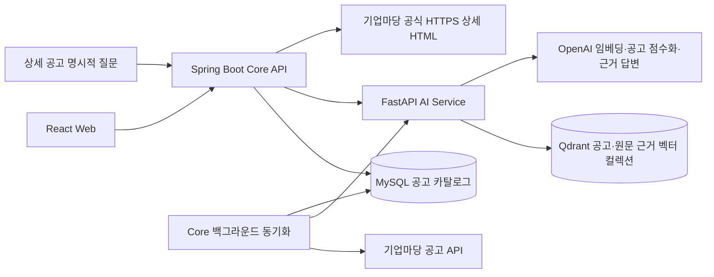

# 프로젝트 기술

[메인 README](../README.md) · [구현 현황](implementation-status.md) · [코드 아키텍처](architecture.md)

이 문서는 저장소의 코드와 설정을 기준으로 각 기술의 역할과 주요 구현 방식을 설명합니다.
기능의 완성 범위와 후속 과제는 [구현 현황](implementation-status.md)에서 관리합니다.

## 시스템 구성



사용자 요청의 진입점은 Core API입니다. 브라우저가 외부 공고 API나 AI Service를 직접 호출하지 않으며,
공공데이터포털 인증키와 OpenAI API 키는 서버에서 사용합니다. 공고 수집은 백그라운드에서 수행하고
사용자 검색은 이미 공개된 MySQL 카탈로그를 읽습니다.

## 기술 스택과 역할

버전은 저장소 설정 기준입니다. 범위로 선언한 패키지의 정확한 설치 버전은 각 lock 파일을 따릅니다.

| 영역 | 기술·설정 | 역할 | 기준 파일 |
|---|---|---|---|
| 웹 런타임 | Node.js 24.x, pnpm 11.22.x | 개발·빌드 환경 | [package.json](../frontend/package.json) |
| 화면 | React 19, TypeScript 6, React Router 8 | 채팅·상세 화면과 URL 라우팅 | [package.json](../frontend/package.json) |
| 웹 도구 | Vite 8, Tailwind CSS 4 | 개발 서버, 번들링, 스타일 | [package.json](../frontend/package.json) |
| 상태·연결 | Redux Toolkit 2, Awilix 13 | 대화 상태, UseCase·Repository 생성과 연결 | [app 구성](../frontend/src/app) |
| 웹 검증 | Zod 4, React Hook Form 7 | HTTP 응답과 예제 폼 검증 | [Frontend 안내](../frontend/README.md) |
| 공개 API | JDK 21, Kotlin 2.4.10, Spring Boot 4.1.0 | HTTP 계약, 업무 흐름, 외부 통신 | [build.gradle](../backend/core-api/build.gradle) |
| DB 접근 | MyBatis Spring Boot Starter 4.0.0, Flyway | XML SQL 실행과 스키마 버전 관리 | [build.gradle](../backend/core-api/build.gradle) |
| 원문 파싱 | jsoup 1.23.2 | 기업마당 상세 HTML의 제목 확인과 공고 본문 추출 | [build.gradle](../backend/core-api/build.gradle) |
| 비밀번호 해시 | spring-security-crypto(BCrypt) | 회원 비밀번호 해시·비교. Security filter chain은 사용하지 않음 | [build.gradle](../backend/core-api/build.gradle) |
| AI API | Python 3.11(Docker·CI), FastAPI 0.139.x, Pydantic 2 | 내부 API와 구조화된 요청·응답 검증 | [pyproject.toml](../backend/ai-service/pyproject.toml) |
| AI 호출 | OpenAI SDK 3.x, Agents SDK 0.22.x, tiktoken | 임베딩, 후보 점수화, 입력 토큰 제한 | [pyproject.toml](../backend/ai-service/pyproject.toml) |
| 공고 저장 | MySQL 8.4 | 현재 공고와 원본 식별자, 신청 기간 저장 | [Compose 설정](../infrastructure/compose.yaml) |
| 의미 검색 | Qdrant 1.17.1, qdrant-client 1.17.x | 임베딩 벡터 저장과 유사도 검색 | [Compose 설정](../infrastructure/compose.yaml) |
| 검증·실행 | Vitest, Testing Library, JUnit, Testcontainers, pytest, Docker Compose | 서비스별 테스트와 컨테이너 통합 검증 | [CI 정의](../.github/workflows/ci.yml) |

AI 패키지는 Python `>=3.11,<3.15`를 선언하며, Frontend와 AI Service의 의존성은 각각
`pnpm-lock.yaml`, `uv.lock`으로 관리합니다. 전체 환경변수는 서비스별 README에서 설명합니다.

## Frontend: 화면과 데이터 처리 분리

### 클린 아키텍처의 의존 방향

지원사업 검색·상세와 SampleItem은 Presentation, Domain, Data의 역할을 나눕니다. 클린 아키텍처에서
이 프로젝트가 적용한 핵심은 **업무 규칙이 외부 구현을 직접 참조하지 않도록 의존 방향을 정하는 것**입니다.

| 위치 | 역할 | 실제 예 |
|---|---|---|
| `presentation` | 화면 표시·사용자 동작·화면 상태 연결 | `ChatPage`, ViewModel Hook, `chatSlice` |
| `domain/entities` | 업무 데이터 | `SupportProgram` |
| `domain/usecases` | 사용자 기능 실행 | `SearchSupportProgramsUseCase` |
| `domain/repositories` | 데이터에 접근할 때 필요한 계약 | `SupportProgramRepository` interface |
| `data` | 계약 구현·HTTP 통신·외부 DTO 검증과 변환 | `SupportProgramRepositoryImpl`, `supportProgramApi` |
| `app` | 구현체 선택·객체 연결·앱 상태 구성 | Awilix 등록, Redux Store |

아래 두 화살표는 서로 다른 의미입니다. 실행 흐름은 실제로 어떤 메서드를 호출하는지,
코드 의존 방향은 어떤 계층의 타입·구현을 참조하는지 나타냅니다.

```text
실행 흐름: View → ViewModel → UseCase → Repository 구현 → HTTP API
핵심 의존: Presentation → Domain ← Data
객체 조립: App에서 Domain UseCase와 Data 구현체를 연결
```

[검색 UseCase](../frontend/src/domain/usecases/SearchSupportProgramsUseCase.ts)는 Domain의 Repository
계약만 생성자로 받고 HTTP 함수를 직접 import하지 않습니다. 반대로
[Repository 구현](../frontend/src/data/repositories/SupportProgramRepositoryImpl.ts)은 Domain interface를
구현하고, HTTP DTO를 `SupportProgram`으로 바꿉니다. API 형식 변경의 영향을 Data 경계에서 처리하고
UseCase 테스트에는 필요한 Repository 대역을 전달할 수 있습니다.

이 방향은 주요 업무 기능에 적용한 설계 원칙입니다. 모든 의존성이 엄격하게 격리된 전체 구조는 아닙니다.
Domain 계약에 요청 취소용 Web 표준 `AbortSignal`이 있고, ViewModel은 앱 컨테이너를 참조합니다.
단순 Health Hook은 별도 Domain UseCase 없이 등록된 외부 함수를 호출합니다.

### Awilix DI와 Service Locator

DI는 객체가 필요한 협력 객체를 스스로 만들지 않고 외부에서 받는 방식입니다. 검색 UseCase가
Repository 구현체를 직접 생성하지 않으므로 데이터 접근 구현과 객체 생성 책임을 분리할 수 있습니다.

[registerRepositories.ts](../frontend/src/app/di/registerRepositories.ts)가 구체 구현체를 등록하고,
[registerUseCases.ts](../frontend/src/app/di/registerUseCases.ts)의 factory가 Repository를 UseCase 생성자에
전달합니다. 두 역할의 인스턴스는 Awilix의 `singleton()`으로 앱 컨테이너 단위로 재사용합니다.
다음은 연결 코드의 핵심입니다.

```typescript
// app/di의 factory가 Repository를 UseCase 생성자에 전달
return new SearchSupportProgramsUseCase(supportProgramRepository)

// ViewModel Hook의 기본 인수는 앱 컨테이너에서 UseCase 조회
appContainer.resolve('searchSupportProgramsUseCase')
```

첫 번째가 생성자 DI이고, 두 번째처럼 사용하는 곳에서 컨테이너를 조회하는 방식은 Service Locator입니다.
현재 Frontend는 두 방식을 함께 사용합니다. Hook 테스트는 선택적 인수에 `execute`를 제공하는 대역을
직접 전달하므로 운영 컨테이너를 바꿀 필요가 없습니다.

Awilix는 UseCase·Repository 등 **협력 객체**를 관리하고 Redux는 메시지·검색 진행 같은 **화면 상태**를
관리합니다. 서로 수명주기를 관리하는 대상이 다릅니다.

### Custom Hook을 ViewModel로 사용하는 MVVM

MVVM은 Model·View·ViewModel의 책임을 나누는 화면 설계입니다. 여기서 Model 측은 업무 데이터와
이를 조회·처리하는 Domain·UseCase·Repository이고, ViewModel은 화면에서 사용할 상태와 동작을 제공합니다.

| 역할 | 실제 코드 | 담당 작업 |
|---|---|---|
| View | [ChatPage.tsx](../frontend/src/presentation/features/chat/view/ChatPage.tsx) | 입력창·결과 카드 렌더링, 사용자 이벤트 연결 |
| ViewModel | [useSupportProgramChatViewModel.ts](../frontend/src/presentation/features/chat/viewmodel/useSupportProgramChatViewModel.ts) | `draft`, `messages`, `isSearching` 등 상태와 `submitMessage` 등 동작 제공 |
| Model 측 | Domain 모델·UseCase·Repository | 검색 조건과 공고 데이터, 검색·상세 조회 실행 |

View는 Hook이 반환한 상태를 렌더링하고 사용자가 제출하면 Hook의 `submitMessage()`를 호출합니다.
Hook은 UseCase 실행과 요청 수명을 관리합니다. Hook을 사용했다는 사실만으로 MVVM이 되는 것이 아니라,
이처럼 화면 동작을 ViewModel의 책임으로 구성했기 때문에 MVVM 방식으로 설명합니다.
사이드바·IME 조합·스크롤 DOM 참조 같은 순수 화면 동작은 View 안에 남겨 둡니다.

### Redux Toolkit의 Flux 계열 단방향 흐름

Flux의 단방향 상태 흐름을 Redux의 Action·Reducer·Store·구독 구조로 적용했습니다.
MVVM은 화면의 책임 분리를, Flux 흐름은 상태 변경과 전달 순서를 설명하므로 두 패턴은 함께 사용됩니다.
Redux Store 자체를 Model 전체나 ViewModel 전체와 같은 것으로 취급하지 않습니다.

```text
ChatPage의 제출 이벤트
  → ViewModel.submitMessage → dispatch(Thunk)
      ├→ dispatch(searchStarted) → chat Reducer → pending 상태
      └→ await UseCase.execute(...)
          ├→ 성공: dispatch(searchSucceeded) → 결과·메시지 반영
          └→ 실패: dispatch(searchFailed) → 안전한 오류 상태
  → Store 변경 → useAppSelector 구독 → ViewModel 반환값 → View 재렌더링
```

Thunk는 비동기 처리를 수행하는 함수이며, 현재 ViewModel 안에 정의되어 Redux 미들웨어가 실행합니다.
HTTP 호출은 UseCase·Repository를 통해 수행하고 [chatSlice](../frontend/src/presentation/features/chat/state/chatSlice.ts)의
Reducer에는 상태 변경 규칙을 둡니다. Slice 내부의 `state.messages.push(...)` 표기는 Redux Toolkit이
Immer로 처리하는 갱신 방식이며 View나 HTTP 코드가 Store 상태를 직접 변경하는 흐름이 아닙니다.

`main.tsx`의 Redux `Provider`가 Store를 화면 트리에 연결하고 Selector가 필요한 상태를 읽습니다.
요청 ID를 비교해 이전 요청의 늦은 결과를 무시하고, 직렬화할 수 없는 `AbortController`는 Store가 아닌
ViewModel의 ref에 보관합니다.

### Hook 상태와 Redux 상태의 선택

| 사용처 | 상태 저장 위치 | 수명 |
|---|---|---|
| 지원사업 채팅 | Redux `chat` slice + ViewModel Hook | 앱 내 화면 이동 동안 메시지·입력 유지 |
| 지원사업 상세 | ViewModel Hook의 로컬 상태 | 화면 진입 때 API 재조회, 이탈 시 로컬 상태 해제 |
| Hook SampleItem | React Hook Form + Hook 로컬 상태 | 화면 이탈 시 입력·결과 초기화 |
| Redux SampleItem | Redux `sampleItem` slice + ViewModel Hook | 앱 내 화면 이동 동안 입력·결과 유지 |

SampleItem의 두 버전 모두 같은 `PrepareSampleItemUseCase`와 API를 사용하며 ViewModel Hook이 있습니다.
비교 대상은 MVVM 적용 유무가 아니라 상태를 어느 곳에 보관하고 얼마나 유지하는가입니다.
현재 상태는 모두 메모리에 있으므로 브라우저 새로고침 시 초기화됩니다. 검색 요청에는 현재 검색 문장만
보내며 이전 메시지를 AI 대화 맥락으로 보내지 않습니다.

Zod가 HTTP 응답을 검증합니다. AbortController와 요청 ID는 화면 이탈·새 대화 이후 오래된 결과가
반영되는 것을 막습니다. 이 취소 처리가 서버의 OpenAI 작업 중단까지 보장하는 것은 아닙니다.
상태 관리 비교용 SampleItem은 별도 예제 화면이며 지원사업 기능과 분리되어 있습니다.

## Core API: 업무 흐름과 외부 경계

### 기능 중심 레이어드 아키텍처

Core API는 기능별 디렉터리 안에서 HTTP, 업무 흐름, 외부 통신, DB 접근의 계층을 구분합니다.
예를 들어 `supportprogram` 안에 Controller·Service·Facade·Client·Repository·Domain이 있습니다.

| 작업 | 기본 호출 방향 |
|---|---|
| 외부 API 호출 | Controller → Service → Facade → Client |
| MySQL 접근 | Controller → Service → Repository → MyBatis Mapper → Mapper XML → MySQL |
| 상태 계산·공고 모델 | 프레임워크와 무관한 Domain |

Controller는 입력 검증과 공개 DTO 변환을, Service는 사용자 기능의 실행 순서를 맡습니다.
`SupportProgramSearchService`는 MySQL 공고 조회·접수 상태 필터·의미 검색·점수화를 조합하고,
`SupportProgramStatusResolver` 같은 Domain 규칙은 프레임워크와 무관하게 상태를 계산합니다.

### Facade를 두는 이유와 실제 책임

Facade는 하위 시스템의 여러 처리 단계를 하나의 진입점으로 제공합니다. Client는 외부 HTTP를
담당하고, Facade는 그 결과가 업무에 사용할 수 있는지 검증하고 내부 모델로 돌려줍니다.
상위 Service가 외부 DTO 필드나 검증 절차를 매번 다루지 않도록 경계를 구성한 것입니다.

| Facade | 감추는 처리 | 상위 코드가 사용하는 결과 |
|---|---|---|
| `BizInfoSupportProgramCatalogFacade` | Client 전체 조회 → Mapper 정규화·검증 → 외부 예외 변환 | 검증된 카탈로그 목록 또는 카탈로그 예외 |
| `BizInfoSupportProgramSourceDocumentFacade` | 공식 상세 HTML 수집 → 읽기 가능한 원문 정규화 → 원문 수집 예외 변환 | 특정 기업마당 공고의 검증된 원문 |
| `AiSupportProgramRetrievalFacade` | 현재 문서 ID·해시 구성 → 의미 검색 호출 → 개수·ID·해시·순서 검증 | 현재 DB에 대응하는 공고 후보 |
| `AiSupportProgramRankingFacade` | AI DTO 생성 → Client 호출 → 버전·점수·자격·추천 이유 검증 | 추천 이유와 점수가 반영된 `SupportProgram` |
| `AiSupportProgramEvidenceFacade` | 원문 청크 색인·검색·답변 호출 → 청크·점수·인용 범위 검증 | 답변 상태와 공식 원문 인용 |

예를 들어 AI가 후보에 없는 ID나 잘못된 점수 합계를 반환하면
[점수화 Facade](../backend/core-api/src/main/kotlin/ai/govbiz/core/supportprogram/facade/AiSupportProgramRankingFacade.kt)가
계약 위반으로 거부합니다. Service는 성공 결과를 받아 검색 응답을 만들고 잘못된 외부 응답 검증은 Facade에 맡깁니다.

모든 호출에 Facade를 추가하지는 않습니다. 상세 DB 조회는 Service가 Repository를 사용하고,
간단한 AI Health 호출과 색인 배치 요청은 Service가 Client를 직접 사용합니다. 업무 흐름의
트랜잭션·동기화 공개 순서도 Facade가 아니라 해당 Service·Repository의 책임입니다.

### Spring 생성자 DI와 계층의 적용 범위

Spring은 등록된 Bean을 다음과 같은 생성자에 전달합니다. `SupportProgramRankingFacade` 계약에는
현재 `AiSupportProgramRankingFacade` 구현체가 연결됩니다.

```kotlin
// SupportProgramSearchService의 생성자 선언 발췌
@Service
class SupportProgramSearchService(
    private val supportProgramRepository: SupportProgramRepository,
    private val rankingFacade: SupportProgramRankingFacade,
    private val retrievalFacade: AiSupportProgramRetrievalFacade,
) {
    // search()에서 주입받은 객체를 사용합니다.
}
```

외부 HTTP 설정과 `Clock`처럼 생성 설정이 필요한 객체는 Config의 `@Bean`에서 조립합니다.
이렇게 생성·연결을 분리하면 Service가 협력 객체를 직접 만들지 않아도 되고 테스트에서 대역을 전달할 수 있습니다.

Core의 Service에는 Spring annotation과 구체 Repository 의존성이 있습니다. 따라서 전체 Core는
기능 중심 레이어드 구조로 설명하며, 모든 외부 의존성을 Domain port로 역전시킨 엄격한 클린 아키텍처로
표현하지 않습니다. DI는 객체 전달 방법이고, 의존성 역전 원칙(DIP)은 코드가 어떤 계약에 의존하는지에
관한 원칙이므로 생성자 주입만으로 둘을 동일시하지 않습니다.

DB 행 타입인 `DbRow`는 MyBatis 경계에서만 사용하며 공개 응답이나 Domain 모델로 노출하지 않습니다.

공개 DTO, 외부 DTO, 예외, 설정은 이를 소유하는 기능 가까이에 둡니다. 정확한 디렉터리와 명명 규칙은
[아키텍처](architecture.md), 실행·환경변수는 [Core API 안내](../backend/core-api/README.md)를 참고하세요.

## AI Service: 기능별 모듈과 객체 조립

AI Service는 현재 기능에 필요한 구체 클래스와 직접 호출을 중심으로 구성합니다. 공통 기반은
`main.py`·`config.py`·`bootstrap.py`에, HTTP·업무 로직은 기능별 모듈에 둡니다.

| 위치 | 책임 |
|---|---|
| `app/main.py` | FastAPI 생성, 라우터 등록, 앱 상태에 컨테이너 연결, 종료 시 자원 해제 |
| `app/config.py` | 환경변수를 `Settings`로 읽고 필수 키·임베딩 설정 등 검증 |
| `app/bootstrap.py` | OpenAI·Qdrant Client, 모델, Agent, Service 생성·생성자 연결 |
| `app/health` | 내부 HTTP 상태 응답 |
| `app/support_program_index` | 문서 임베딩·색인·후보 검색의 Router, Models, Service |
| `app/support_program_ranking` | 후보 점수화의 Router, Models, Prompt, Agent, Service, Errors |
| `app/support_program_evidence` | 공식 원문 청크의 별도 색인·검색과 근거 답변 Router, Models, Service, Agent, Prompt, Errors |

[bootstrap.py](../backend/ai-service/app/bootstrap.py)는 객체를 조립하는 곳입니다. 하나의 OpenAI Client를
모델 실행과 임베딩에 연결하고, Qdrant Client를 일반 공고 Index Service와 원문 Evidence Service에,
각각의 typed Agent를 점수화·근거 답변 Service에 생성자로 전달합니다. 이 객체들은
`ApplicationContainer`에 보관되고 앱 종료 시 Client 연결을 닫습니다.

[main.py](../backend/ai-service/app/main.py)는 조립된 컨테이너를 `app.state.container`에 연결합니다.
Router의 `Depends` 함수는 여기서 해당 Service를 꺼내 endpoint에 전달합니다. 별도의 DI 라이브러리나
범용 registry 없이 명시적인 객체 생성·생성자 주입과 FastAPI의 요청 의존성 연결을 사용합니다.

### 점수화 모듈의 책임 분리

```text
HTTP API → Router → Ranking Service → Recommendation Agent → OpenAI
                         ↑                     ↓
                         └── 구조화된 출력 ─────┘
                         ↓
              후보 검증·정렬·기준 적용 → Response
```

`router.py`는 HTTP 요청·응답과 안전한 오류 변환을, `models.py`는 Pydantic 요청·출력 스키마와
점수 합계 등의 불변식을 담당합니다. `prompt.py`는 LLM에 전달할 평가 지시를 담고, `agent.py`는
Agents SDK 실행·제한시간·모델 오류 처리를 맡습니다. `service.py`는 모든 후보가 빠짐없이 점수화되었는지
검증하고 정렬·최소 기준·자격 필터를 적용합니다.

프롬프트에 올바르게 답하라고 지시하는 것과 코드에서 결과를 검사하는 역할을 분리했습니다.
예를 들어 모델이 전달받지 않은 공고 ID를 반환하면 Service가 거부하고 Router가 안전한 오류로 변환합니다.
정상 결과도 Core API에서 다시 계약 검증을 거칩니다.

### 색인·검색 모듈과의 차이

색인·검색은 `HTTP API → Router → Index Service → OpenAI 임베딩·Qdrant → Response` 흐름입니다.
`support_program_index/service.py`가 문서 버전 확인·임베딩 생성·Qdrant 저장·검색을 직접 수행합니다.
기업마당 수집이나 MySQL 조회는 Core가 맡으며 AI Service는 전달받은 문서·ID·해시를 사용합니다.

업무 Agent는 후보 점수화용과 원문 근거 답변용 두 개입니다. 임베딩과 벡터 검색을 별도 Agent로 구성하지 않았으며,
tool·handoff·graph 없이 각 Agent를 `max_turns=1`로 실행합니다. 실행 설정은
[AI Service README](../backend/ai-service/README.md), Agent 추가 기준과 테스트 배치는
[Agent 모듈 구조](../backend/ai-service/docs/agent-structure.md)를 참고하세요.

## MySQL과 Qdrant의 역할

| 구분 | MySQL | Qdrant |
|---|---|---|
| 저장 대상 | 공고 제목·요약·신청 기간·출처·노출 상태, 공고별 공식 원문 텍스트 | 공고 검색 텍스트 임베딩, 원문 청크 임베딩과 각 ID·내용 해시 |
| 주요 용도 | 현재 검색 대상 결정·상세 조회, 원문 질문의 캐시 | 검색 문장 후보 선정, 특정 원문 질문의 근거 청크 선정 |
| 갱신 방식 | 제공처별 공고 UPSERT·누락 비활성화, 명시적 질문 성공 후 원문 UPSERT | 공고 ID·내용 해시별 벡터 생성·재사용, 원문 청크 전용 별도 컬렉션 색인 |
| 데이터 기준 | 현재 공개 카탈로그·공개 공고에 연결된 공식 원문 | MySQL 원문·공고 모델에서 재구성할 수 있는 파생 색인 |

MySQL의 `support_program`은 `(source_code, source_program_id)`를 고유키로 사용합니다.
분야·지역은 JSON 배열로, 신청 기간은 원문과 nullable 날짜로 저장합니다. `support_program_sync_generation`은
가장 최근에 시작된 동기화 세대를 기록합니다. `support_program_source_document`는 같은 복합 식별자에
공식 HTML에서 정규화한 원문·URL·해시·수집 시각을 저장하며, 공고를 FK로 참조하고 조회 시 공개 상태를 확인합니다.
이 테이블은 명시적 기업마당 원문 질문에서 원문 수집·검증이 성공했을 때 채워집니다. 세 테이블은
[Flyway migration](../backend/core-api/src/main/resources/db/migration)으로 생성합니다.

접수 상태는 DB에 고정 저장하지 않고 조회 시 `Asia/Seoul`의 오늘 날짜로 계산합니다. 파싱된 날짜를
우선하고, 날짜만으로 결정하지 못한 경우 예정·종료·상시 등의 알려진 표현을 해석합니다. 종료 표현은
상시 표현보다 우선하며, 판정할 수 없으면 `UNKNOWN`입니다. 원문에 적힌 모든 예외 조건을 이해하는 판정기는 아닙니다.

검색 문서는 제목·기관·지원대상·분야·지역·신청기간·요약을 결합합니다. Core가 최대 12,000 코드 포인트로
제한한 텍스트의 SHA-256을 계산하고, AI Service는 임베딩 입력을 최대 8,191 토큰으로 제한합니다.
벡터 식별에는 `sourceCode:sourceProgramId`와 내용 해시를 함께 사용합니다. MySQL에 `content_hash` 컬럼은 있지만
현재 Repository는 이를 읽고 쓰지 않으며, 해시는 [검색 문서 Mapper](../backend/core-api/src/main/kotlin/ai/govbiz/core/supportprogram/client/ai/mapper/SupportProgramIndexDocumentMapper.kt)에서 계산합니다.

원문 질문은 기업마당 공식 HTTPS 상세 HTML만 최대 500KB로 읽습니다. 자동 리디렉션을 끄고 매 이동마다
공식 HTTPS 호스트와 동일한 `pblancId`를 확인해 최대 3회 따릅니다. jsoup `1.23.2`로 HTML을 파싱한 뒤
`.support_project_detail`의 `.title_area .title`이 요청 공고 제목과 일치하는지 확인하고 `.view_cont` 본문만
최대 30,000자로 정규화합니다. Core의 `SupportProgramEvidenceChunker`가 텍스트·원문 해시·순서에서 결정적으로
최대 50개, 각 최대 1,500 UTF-16 코드 단위의 청크를 만듭니다. AI Service는 일반 공고 벡터와 다른 Qdrant evidence
컬렉션에 이 청크만 색인하고, 해당 공고의 청크를 최대 5개 검색해 근거 답변 Agent에 전달합니다.
Core는 선택한 인용 청크 전체를 반환해 답변의 근거가 청크 뒤쪽에 있어도 확인할 수 있게 합니다.

## 동기화와 색인 공개

```text
동기화 세대 발급 → 기업마당 전체 페이지 수집·검증 → 전체 공고 벡터 준비
    → 최신 시작 세대인지 확인 → MySQL 카탈로그를 하나의 트랜잭션으로 공개
```

기본 스케줄은 앱 시작 시 초기 지연 `PT0S`로 한 번, 이후 이전 실행이 끝난 시점부터 6시간 뒤입니다. 외부 수집과
색인은 DB 트랜잭션 밖에서 수행합니다. 모든 벡터가 준비된 뒤 현재 세대만 DB에 반영하므로,
색인 실패로 신규 공고의 검색 준비가 끝나지 않으면 기존 공개 카탈로그를 유지합니다.

DB 반영은 기존 `BIZINFO` 공고를 미노출 처리한 뒤 이번 목록을 UPSERT해 다시 노출하는 방식입니다.
이 두 작업은 한 트랜잭션이며 실패하면 함께 롤백됩니다. 늦게 끝난 이전 동기화는 세대 확인에서 공개를
건너뜁니다. 세대 관리는 중복 수집·색인 실행 자체를 막는 분산 잠금은 아닙니다.

별도 복구 스케줄러도 앱 시작 시 초기 지연 `PT0S`로 실행하고, 이후 완료 시점부터 1분마다 현재 MySQL 공고를 확인합니다.
동일한 벡터가 있으면 재사용하고 누락된 버전만 생성합니다. `SUPPORT_PROGRAM_INDEX_ENABLED=false`는
이 복구 스케줄러를 끄며, 기업마당 동기화 안의 공개 전 색인까지 끄지는 않습니다.

두 자동 경로는 `prune`을 호출하지 않습니다. 이전 내용·미노출 공고의 벡터는 현재 ID·해시 허용 목록에서
빠져 검색에 쓰이지 않지만 저장 공간은 남습니다. 안전한 삭제 수명주기는 후속 구현 범위입니다.

## 검색과 AI 점수화

1. MySQL에서 현재 노출된 모든 제공처 공고를 읽고 접수 상태 조건을 적용합니다.
2. 공고 ID·해시 허용 목록을 AI Service에 보내 Qdrant 검색 범위를 제한합니다.
3. OpenAI로 검색 문장을 임베딩하고 유사도 순으로 후보를 최대 20개 가져옵니다.
4. OpenAI Agents SDK의 단일 Agent가 후보 전체를 구조화된 응답으로 점수화합니다.
5. AI Service가 최소 점수·자격 조건을 적용하고 Core가 계약을 다시 검증해 최대 5개를 반환합니다.

대상 공고가 없으면 빈 목록을 반환합니다. 검색어가 비어 있으면 최신순 최대 5개를 반환하며,
두 경우 모두 AI Service를 호출하지 않습니다. 채팅 UI에서는 빈 검색어를 제출할 수 없습니다.

점수화의 실제 호출 방향은 `HTTP API → Service → Agent → OpenAI → Response`입니다.
벡터 검색은 별도 내부 API와 Qdrant를 사용하는 경로이며, 다중 Agent나 도구 탐색을 수행하지 않습니다.

| 점수 항목 | 최대 점수 |
|---|---:|
| 의미 관련성 | 40 |
| 지원대상 적합성 | 25 |
| 지역 적합성 | 15 |
| 접수 상태 적합성 | 10 |
| 지원 유형 적합성 | 10 |

`govbiz-support-program-ranking-v3`는 의미 관련성 20점 이상·총점 60점 이상을 요구합니다.
`targetEligibility` 또는 `regionEligibility`가 `INCOMPATIBLE`이면 제외하고, 정보가 부족한
`UNKNOWN`은 그 이유만으로 제외하지 않습니다. 이 값과 추천 점수는 신청 자격이나 선정 확률을 확정하지 않습니다.
상세한 필드와 오류 응답은 [검색 계약](support-program-search-contract.md)에 정리되어 있습니다.

저장소의 기본 설정은 점수화 `OPENAI_MODEL=gpt-5.6-luna`, 임베딩 `text-embedding-3-small`·1,536차원입니다.
설정은 [AI Service config](../backend/ai-service/app/config.py)와 [.env.example](../.env.example)을 기준으로 합니다.
키 누락은 AI Service 시작 오류이며, 검색 중 모델·벡터 장애는 오류 응답으로 반환합니다.

## 원문 근거 RAG 답변

원문 근거 답변은 목록 검색의 후보 선정·점수화와 독립된 **상세 공고별 명시적 질문**입니다.
`POST /api/v1/support-programs/detail/answers`가 먼저 현재 공개 공고를 확인합니다. `BIZINFO`가 아니면
422를 반환하고, 기업마당 공고라면 URL이 같고 수집 후 6시간이 지나지 않은 MySQL 원문을 재사용합니다.
캐시가 없거나 오래됐을 때만 Core가 공식 상세 HTML을 수집·검증·저장합니다.

그 뒤 `AiSupportProgramEvidenceFacade`는 전체 청크 색인을 확인하고, 질문과 가까운 청크 최대 5개만
근거 답변 Agent에 전달합니다. Agent는 전달받은 텍스트 밖의 정보를 쓰지 않도록 지시되며, `ANSWERED`에는
최소 한 개의 청크 ID를 인용해야 합니다. Core는 인용 ID가 실제 검색한 청크 집합의 부분집합인지 재검증해
원문 URL·발췌·청크 순서를 공개합니다. 근거가 부족하면 `INSUFFICIENT_EVIDENCE`와 인용 없는 안내를 반환합니다.

이 범위에는 기업마당 첨부파일, PDF·OCR, 다른 제공처 원문, 질문 이력의 재사용이 포함되지 않습니다.
공식 원문 수집·저장·AI 오류는 목록 검색·동기화·상세 GET에 fallback이나 부작용을 만들지 않습니다.
필드와 오류 계약은 [검색·상세 API 계약](support-program-search-contract.md)을 참고하세요.

## 개발 환경과 검증

Docker Compose는 Vite 개발 서버, Core API, AI Service, MySQL, Qdrant를 함께 실행합니다.
AI Service는 기본 Compose에서 호스트 포트를 공개하지 않고 서비스 네트워크로 연결합니다.
이 구성에 운영 인증·배포 자동화가 포함되어 있다고 가정하면 안 됩니다.

[GitHub Actions](../.github/workflows/ci.yml)는 Frontend 테스트·lint·build, Core 빌드·MySQL 통합 테스트,
AI 테스트·패키지 빌드·평가 도구 테스트, 컨테이너 통합 검증을 정의합니다. Compose 검증은 실제
MySQL·Qdrant와 로컬 기업마당·OpenAI 스텁을 사용해 연결과 장애 복구를 확인합니다.
실제 공고 검색의 정확도와 원문 인용 답변의 정확도는 각각 별도의 실데이터 평가 대상입니다.
